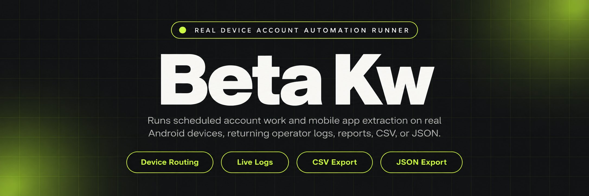
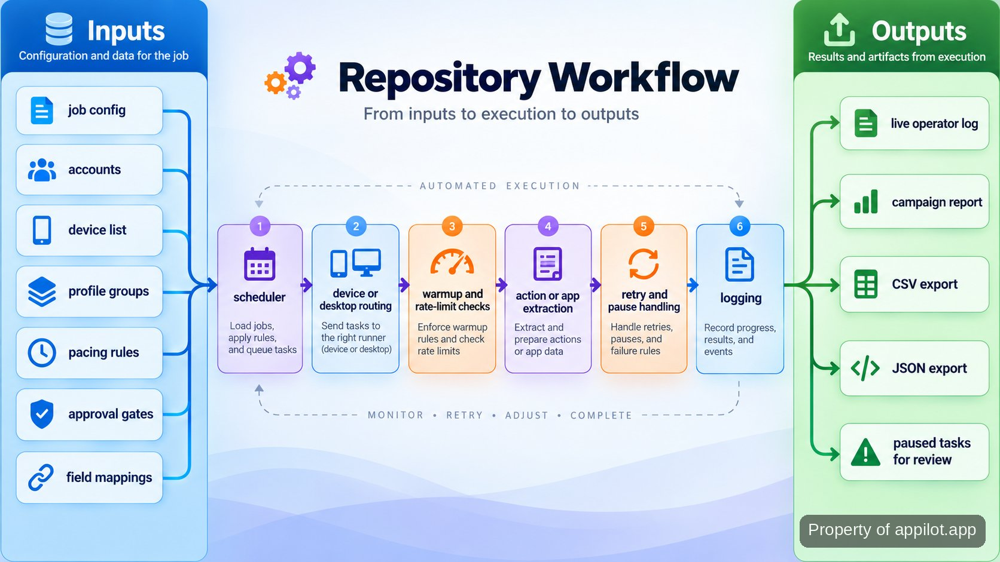

<p align="center">
  <a href="https://www.appilot.app" target="_blank" rel="nofollow">
    
  </a>
</p>

## beta kw

**beta kw** is the repository I use to schedule account work on genuine Android devices, route desktop tasks into isolated browser profiles, extract structured data from mobile apps, and run warmup-aware engagement with operator controls. It is built for the point where doing the same action by hand across many accounts stops being practical. The important boundary is equally clear: the tool manages timing, queues, approvals, retries, logs, and device or profile assignment; it does not make an account undetectable, guarantee that an account will not get banned, or decide whether an action is allowed by a platform.

The mobile path runs against physical Android hardware rather than emulators. Desktop jobs are routed through isolated profiles, while extraction jobs normalize app data into CSV or JSON. High-risk actions can wait at an approval gate, warmup jobs follow staged playbooks, and health rules can pause activity when configured risk signals appear. That combination makes the repository useful as an operator tool rather than a pile of one-off scripts.

<a href="https://www.appilot.app" target="_blank" rel="nofollow">
  
</a>

<p align="center">
  <a href="https://t.me/Bitbash333" target="_blank" rel="nofollow">
    
  </a>&nbsp;
  <a href="https://wa.me/923249868488?text=Hi%2C%20I%27m%20interested." target="_blank" rel="nofollow">
    
  </a>&nbsp;
  <a href="mailto:hello@appilot.app" target="_blank" rel="nofollow">
    
  </a>&nbsp;
  <a href="https://www.appilot.app" target="_blank" rel="nofollow">
    
  </a>
</p>

## What the workflow actually does

A run starts with a job definition: target devices or profile groups, the account action or extraction task, pacing rules, and any approval requirement. The scheduler assigns work to the matching device or desktop profile, opens the relevant session, performs the configured action, and writes live status into the operator log. A failed step is recorded and can be retried by the run policy instead of disappearing into a terminal window.

For mobile extraction, the session reads the mapped fields, normalizes them, and writes structured exports. For outreach or engagement, the queue applies configured rate limits and warmup-aware pacing before dispatch. For desktop work, the adapter hands profile operations to the selected profile manager. The same run therefore has visible inputs, a controlled execution path, and an output that can be inspected after the overnight work finishes.

Scheduling keeps assignment separate from execution. A job can target a device group or desktop profile group without embedding one machine into the task itself; the router resolves the available target when the run starts. That matters when a device is offline or a profile is unavailable, because the scheduler can record the assignment failure instead of letting the action script continue with the wrong account context. The operator log then shows whether the run is waiting, retrying, paused, or complete.



## Core Features

| Feature | Description |
| --- | --- |
| Physical Android device routing | Emulator drift is removed from the mobile path by assigning jobs to genuine Android hardware and keeping device operations under centralized scheduling and monitoring. |
| Scheduled account actions | Manual repetition across many accounts is replaced by queued outreach, engagement, posting, and other configured account actions that can run on a schedule. |
| Live logs and retries | Silent failures are harder to miss because operators can see run logs, failed steps, and retry activity instead of checking each device separately. |
| Desktop profile adapters | Repeated profile handling is routed through <a href="https://localapi-doc-en.adspower.com/docs/" target="_blank" rel="nofollow">AdsPower Local API</a> or the <a href="https://multilogin.com/help/en_US/api" target="_blank" rel="nofollow">Multilogin automation API</a>, keeping profile-group work inside the same task flow. |
| Structured mobile extraction | Copying app data by hand is replaced by mapped field extraction, normalization, and CSV or JSON exports suitable for downstream warehouse loading. |
| Warmup and action governance | Account actions that should not fire immediately can pass through staged warmup, rate limits, approval gates, and pause-on-risk rules before later campaign work. |

## Inputs, routing, and outputs

The main inputs are configuration, account assignments, device or profile groups, schedules, pacing rules, approval settings, and extraction field maps. A profile means an isolated desktop browser identity with its own session state. Warmup means staged activity before higher-volume work. A rate limit is the configured cap on how quickly queued actions are dispatched.

Outputs depend on the job. Automation runs produce operator-visible logs and campaign reporting. Mobile scraping jobs produce CSV or JSON with the requested fields normalized to the configured schema. A paused job remains visible for review rather than being treated as success. The repository does not convert these controls into a promise about bans; platform enforcement remains outside the tool.

Configuration validation is the first guard against avoidable run errors. Before dispatch, the CLI checks that referenced devices and profile groups exist, required job fields are present, and the selected output path matches the job type. This catches broken references before an overnight run fans them out across accounts. It also gives the operator one place to fix configuration rather than diagnosing the same mistake separately on every device.

<a href="https://tally.so/r/yP5oDx?platform=GitHub&amp;format=Product+repo&amp;brand=Appilot&amp;niche=appilot&amp;page=beta+kw+on+Real+Android+Hardware&amp;date=2026-09-24" target="_blank" rel="nofollow">
  
</a>

## Tech Stack

The runner is Python, which keeps scheduling, adapters, extraction, and export code in one readable codebase; the <a href="https://docs.python.org/3/" target="_blank" rel="nofollow">Python documentation</a> is the reference for the runtime. Android connectivity uses <a href="https://developer.android.com/tools/adb" target="_blank" rel="nofollow">Android Debug Bridge</a> for device access, while <a href="https://appium.io/" target="_blank" rel="nofollow">Appium</a> handles app-level UI automation where a task needs to drive the Android interface.

Desktop automation stays behind provider adapters so profile-group routing does not leak provider-specific calls into the scheduler. CSV and JSON exporters sit after normalization, which keeps extraction logic separate from storage format. For broader context on the mobile and social environment these workflows operate in, I use the <a href="https://www.gsma.com/about-us/regions/europe/gsma_resources/the-mobile-economy-2026/" target="_blank" rel="nofollow">GSMA Mobile Economy 2026</a> and <a href="https://datareportal.com/reports/digital-2026-mid-year-global-update-report" target="_blank" rel="nofollow">DataReportal Digital 2026 Mid-Year Update</a> as external background, not as evidence of this repository's performance.

## Directory Structure

The repository separates device control, desktop profile adapters, warmup rules, extraction, exports, and operator-facing logging. That matters when a run fails: the failing layer can be inspected without digging through one large script, and provider-specific changes stay isolated from the core scheduler.

```text
automation-runner/
├── pyproject.toml
├── requirements.txt
├── config.example.yaml
├── src/
│   ├── runner/
│   │   ├── __main__.py
│   │   ├── scheduler.py
│   │   ├── approvals.py
│   │   ├── retries.py
│   │   └── logging.py
│   ├── mobile/
│   │   ├── adb.py
│   │   ├── appium_runner.py
│   │   └── extract.py
│   ├── desktop/
│   │   ├── adspower.py
│   │   └── multilogin.py
│   ├── warmup/
│   │   ├── playbooks.py
│   │   └── health.py
│   └── exports/
│       ├── csv_writer.py
│       └── json_writer.py
├── logs/
└── exports/
```

## How to Run Account Work Using beta kw

- **STEP 1 — Download & Set Up the Project**  
Download, set up, and install **beta kw** to get the project running. Clone this repository, create the Python environment, install requirements, and copy the example configuration.
- **STEP 2 — Validate Devices and Profiles**  
Run the validation command against `config.yaml` so the CLI checks configured Android devices, desktop profile groups, credentials, and required job fields before dispatch.
- **STEP 3 — Configure the Job**  
Set the target accounts, device or profile group, schedule, pacing rules, approval gate, action type, and extraction field map required for this run.
- **STEP 4 — Run and Inspect Output**  
Start the `run` command, watch the operator log, then inspect campaign reporting or the generated CSV and JSON files; paused tasks stay available for review.

```bash
python -m venv .venv
source .venv/bin/activate
pip install -r requirements.txt
cp config.example.yaml config.yaml
python -m runner validate --config config.yaml
python -m runner run --config config.yaml
```

## Failure handling and operator control

The useful part of automation is not merely that an action can be repeated; it is that failure has a defined place to go. Device or profile errors are written to the run log, retryable work follows the configured retry path, and tasks that hit a risk rule can pause instead of continuing blindly. That makes the next operator decision visible.

Approval gates are used for higher-risk account actions. Pacing rules prevent the queue from dispatching work faster than the configured policy, and warmup playbooks keep staged activity separate from full campaign actions. These controls reduce accidental over-dispatch, but they do not turn the system into a compliance checker or a ban-prevention guarantee. The operator still owns platform rules, account policy, and the decision to resume a paused task.

## Use Cases

- Run scheduled outreach or engagement across assigned real Android devices overnight, with queues, pacing, live logs, and retries replacing repeated manual taps per account.
- Extract mapped fields from a mobile app on genuine hardware, normalize the records, and hand off CSV or JSON instead of maintaining a copy-and-paste collection process.
- Route desktop work by profile group through AdsPower or Multilogin so isolated sessions remain attached to the right tasks and operator logs stay centralized.
- Move accounts through staged warmup before later campaign actions, using device/profile pairing, health checks, pause rules, and approval gates where the workflow calls for human review.

## Runtime behavior and operational checks

This repository does not publish a fixed throughput, uptime, or per-account timing figure. Run duration depends on the configured pacing, the amount of queued work, device availability, profile state, target-app response time, and whether an approval or pause interrupts execution. Treat any single speed number as workload-specific rather than a property of the tool.

The practical checks are deterministic instead: validation confirms the configured resources are reachable; each job gets a visible state; failures are logged; retryable steps follow the retry policy; paused work is not reported as completed; and extraction jobs write the expected CSV or JSON schema. Those checks are what I use before trusting an overnight run.

## FAQ

### Does this use emulators for Android automation?

No. The mobile workflow is designed for genuine Android hardware, with centralized scheduling and monitoring around physical devices. The desktop path is separate and uses isolated browser profiles rather than pretending a browser profile is an Android device.

### How are higher-risk account actions controlled?

They can be held behind approval gates and dispatched under configured queues, rate limits, and warmup-aware pacing. Health rules can pause work when configured risk signals appear. Those controls govern the automation; they do not guarantee that a platform will accept an action or that an account will avoid enforcement.

### What does the mobile app extraction path export?

It exports structured CSV or JSON after field mapping and normalization. The schema is defined by the extraction configuration, so downstream work receives named fields rather than raw screen text. The output is intended to be ready for a warehouse or another data-processing step.

<table>
  <tr>
    <td align="center" width="33%">
      
      <p>This scraper helped me gather thousands of posts effortlessly. The setup was fast, and exports are super clean and well-structured.</p>
      <p><b>Nathan Pennington</b><br>Marketer<br>★★★★★</p>
    </td>
    <td align="center" width="33%">
      
      <p>What impressed me most was how accurate the extracted data is. Likes, comments, timestamps — everything aligns perfectly.</p>
      <p><b>Greg Jeffries</b><br>SEO Affiliate Expert<br>★★★★★</p>
    </td>
    <td align="center" width="33%">
      
      <p>It's by far the best tool I've used. Ideal for trend tracking, competitor monitoring, and influencer insights.</p>
      <p><b>Karan</b><br>Digital Strategist<br>★★★★★</p>
    </td>
  </tr>
</table>