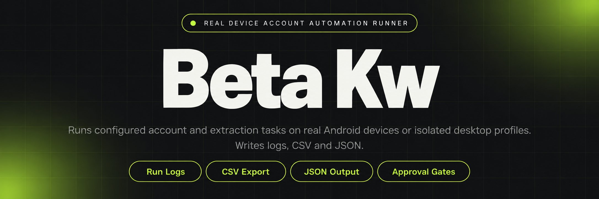
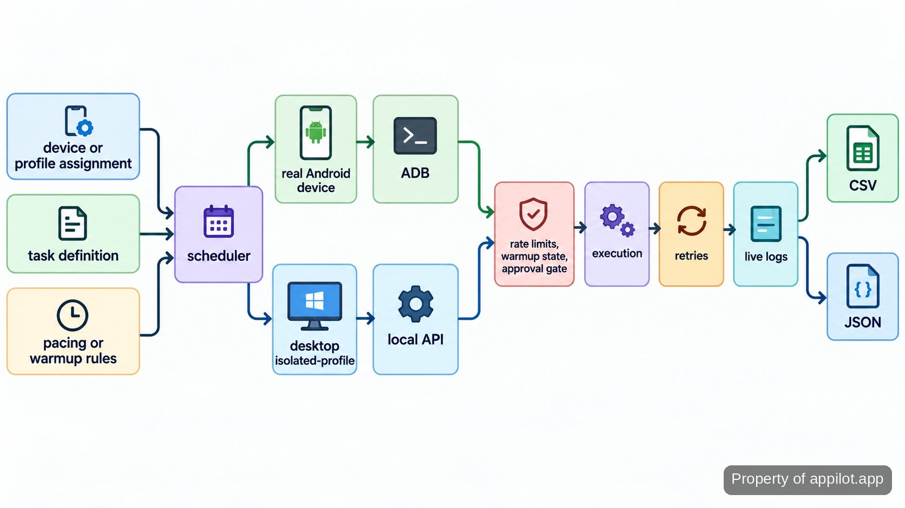

<p align="center">
  <a href="https://www.appilot.app" target="_blank" rel="nofollow">
    
  </a>
</p>

## beta kw

**beta kw** is the repository I use to run account and device automation on genuine Android hardware, with a second path for fingerprint-isolated desktop profiles. It covers the parts that are difficult to keep reliable by hand: assigning work to devices or profiles, scheduling actions, pacing activity, recovering failed jobs, and recording what happened. The same project also handles structured mobile app extraction, warmup routines, and operator approval gates for actions that should not run unattended.

The operating model is simple: configuration goes in, a scheduler turns it into device or profile work, controls decide whether an action is allowed to proceed, and the runner writes logs plus structured output. Real phones are the execution target for mobile work; emulators are not part of this setup. For Android access, the repository expects the standard <a href="https://developer.android.com/tools/adb" target="_blank" rel="nofollow">Android Debug Bridge</a> path rather than a simulated device layer.

<a href="https://www.appilot.app" target="_blank" rel="nofollow">
  
</a>

<p align="center">
  <a href="https://t.me/Bitbash333" target="_blank" rel="nofollow">
    
  </a>&nbsp;
  <a href="https://wa.me/923249868488?text=Hi%2C%20I%27m%20interested." target="_blank" rel="nofollow">
    
  </a>&nbsp;
  <a href="mailto:hello@appilot.app" target="_blank" rel="nofollow">
    
  </a>&nbsp;
  <a href="https://www.appilot.app" target="_blank" rel="nofollow">
    
  </a>
</p>

## Core Features

| Feature | Description |
| --- | --- |
| Physical device control | Manual device-by-device work gets brittle once several accounts are moving at once. The controller provisions work to genuine Android phones, keeps device assignments explicit, and lets scheduled jobs run without pretending an emulator is a phone. |
| Scheduled account actions | Repeating outreach, engagement, posting, or warmup steps by hand creates missed windows and inconsistent pacing. Tasks are queued from configuration and released according to the schedule and per-account rules. |
| Live logs and retries | Silent failures are expensive because a broken session can sit unnoticed. Each run records task state, failure details, and retry activity so an operator can see what stopped and what was attempted next. |
| Desktop profile routing | Managing isolated browser profiles manually becomes another queue to babysit. The desktop path connects to <a href="https://localapi-doc-en.adspower.com/" target="_blank" rel="nofollow">AdsPower Local API</a> or <a href="https://multilogin.com/help/en_US/api-desktop/" target="_blank" rel="nofollow">Multilogin API</a> and routes work by profile group. |
| Structured app extraction | Copying app data into ad hoc notes makes later analysis painful. Extraction jobs normalize selected fields and write CSV or JSON outputs that can be loaded elsewhere without scraping the logs themselves. |
| Warmup and risk controls | Accounts should not all receive the same action volume on the same day. Warmup stages, rate limits, pause rules, and approval gates keep high-risk actions under operator control instead of assuming the platform will accept them. |

## Workflow From Input to Output

A run starts with three kinds of input: device or profile assignments, a task definition, and the pacing or warmup rules that apply to the account. The scheduler reads those files and creates work for the correct execution path. Mobile jobs go to a paired Android device through ADB. Desktop jobs open the mapped isolated profile through its local API. Before an account action is released, the controls layer checks queue limits, warmup state, and whether the action requires approval.

After execution, the runner records success or failure, applies the configured retry behavior, and writes any extracted records separately from operational logs. CSV exports follow the familiar row-and-column shape defined by <a href="https://www.rfc-editor.org/rfc/rfc4180" target="_blank" rel="nofollow">RFC 4180</a>; JSON exports use the object format standardized in <a href="https://www.rfc-editor.org/rfc/rfc8259" target="_blank" rel="nofollow">RFC 8259</a>. That separation matters: account operations stay auditable while extracted data remains usable as data.



## Technical Stack

The repository uses Python as the controller language because the work is mostly API calls, process control, configuration parsing, and structured file output. Android jobs use <a href="https://developer.android.com/tools/adb" target="_blank" rel="nofollow">ADB documentation</a> as the device control surface. Desktop work talks to the profile manager through its local API rather than driving the profile manager UI with screen clicks.

Configuration is kept as YAML for operator-edited task and device files, while run results are written as JSON logs and CSV or JSON datasets. The scheduler, execution adapters, controls, and output writers are separate modules so a failure in one profile or device path does not need to change the data format or logging path. Log fields follow a predictable event structure so they can be searched or forwarded later; the <a href="https://cheatsheetseries.owasp.org/cheatsheets/Logging_Cheat_Sheet.html" target="_blank" rel="nofollow">OWASP logging guidance</a> is a useful reference for keeping operational logs specific without dumping sensitive session material.

## Project Directory

The file layout mirrors the run path rather than hiding everything behind one entry point. Operator-facing configuration stays under `configs`, execution adapters live under `src`, and generated artifacts are separated into `logs` and `outputs`. That makes it easy to inspect a failed run without opening extraction code, or change a device mapping without touching the scheduler.

```text
automation-runner/
├── pyproject.toml
├── .env.example
├── configs/
│   ├── devices.yaml
│   ├── profiles.yaml
│   ├── tasks.yaml
│   └── warmup.yaml
├── src/
│   ├── runner.py
│   ├── scheduler.py
│   ├── devices/
│   │   └── adb.py
│   ├── desktop/
│   │   └── profiles.py
│   ├── controls/
│   │   ├── pacing.py
│   │   └── approvals.py
│   ├── extract/
│   │   ├── normalize.py
│   │   └── writers.py
│   └── observability/
│       └── events.py
├── logs/
│   └── .gitkeep
├── outputs/
│   └── .gitkeep
└── tests/
    ├── test_controls.py
    └── test_writers.py
```

<a href="https://tally.so/r/yP5oDx?platform=GitHub&amp;format=Product+repo&amp;brand=Appilot&amp;niche=appilot&amp;page=Beta+Kw+on+Android+Hardware&amp;date=2026-09-24" target="_blank" rel="nofollow">
  
</a>

## Configuration and Commands

Setup is local. After the repository is available on the machine, create an isolated Python environment, install the project, connect the Android phones so `adb devices` can see them, and copy the example environment file before adding local credentials. Desktop profile credentials stay in environment variables rather than in `profiles.yaml`; the YAML file stores routing information, not secrets.

```bash
python -m venv .venv
source .venv/bin/activate
pip install -e .
adb devices
cp .env.example .env
python -m src.runner --config configs/tasks.yaml
```

The task file names the account or profile group, the action, its schedule, and the control policy to apply. Device mappings live separately so replacing a phone does not require rewriting every task. For extraction jobs, field mapping belongs beside the task definition and the normalized records are written under `outputs`, while execution events go under `logs`.

## How to Run Account Automation Using beta kw

- **STEP 1 - Download & Set Up the Project** Download, set up, and install **beta kw** to get the project running. The repository is the distribution point, so place it locally and install the pinned project dependencies.
- **STEP 2 - Open the Control Files** Edit `devices.yaml`, `profiles.yaml`, and `tasks.yaml` so each account points at the correct phone or isolated desktop profile.
- **STEP 3 - Set Pacing and Approval Rules** Choose the warmup stage, rate limits, queue behavior, and any approval gate required before the configured account action can run.
- **STEP 4 - Run and Inspect Output** Start `python -m src.runner --config configs/tasks.yaml`, then read execution events in `logs` and extracted CSV or JSON records in `outputs`.

## Failure Handling and Governance

Automation is most useful when the boring failures are visible. A disconnected phone, expired desktop session, blocked action, or malformed extraction result should become an event an operator can inspect, not a vague “job failed” line. The runner keeps execution state in the log, applies retry behavior where the task permits it, and leaves high-risk account actions behind an approval gate when the policy requires human review.

Warmup and pacing are treated as controls, not promises. The repository can stage activity, cap queues, pair accounts with devices or profiles, and pause work when a configured risk rule fires. It cannot decide whether a platform will flag or ban an account, and the configuration should never be read as a guarantee that an action is allowed by a platform. The useful part is operational discipline: the same account policy is applied every time instead of depending on whoever is awake when the run starts.

## Use Cases

- **Run scheduled account work overnight:** queue outreach, engagement, posting, or warmup actions so each account follows its assigned pacing rules without manual handoffs.
- **Keep large device sets understandable:** pair accounts to real Android phones, keep mappings in one place, and see failures in live logs instead of checking devices one by one.
- **Route desktop work by isolated profile:** send tasks to the right AdsPower or Multilogin profile group while preserving the profile separation already used by the operator.
- **Extract structured mobile app data:** capture selected fields on real devices, normalize them, and hand the result to another system as CSV or JSON rather than copying values manually.
- **Move warmed accounts into production routines:** apply staged warmup rules first, then hand the same account into scheduled bot campaigns with rate limits, pause rules, and approvals still active.

## Outputs and Operational Checks

A normal run leaves two evidence trails: operational events and business data. The event log answers which account, device or profile received a task, what state it reached, whether it retried, and where it stopped. Extraction output answers a different question: what records were collected after field mapping and normalization. Keeping those files separate means a downstream import does not need to parse execution noise.

Before a scheduled batch is left to run, I check that every Android device is visible to ADB, every desktop profile group resolves through its API, and the task file points to the intended control policy. After the run, the first check is not “did everything succeed?” but “is every failure explainable from the log?” That is the standard that makes the repository practical to operate repeatedly.

## FAQ

### Does it run on real Android phones or emulators?

It runs mobile automation on genuine Android hardware. The device path uses ADB to communicate with connected phones; emulators are not part of this repository’s mobile execution model. Desktop automation is separate and works through isolated profiles managed by AdsPower or Multilogin.

### How are risky account actions controlled?

Risky actions can be held behind approval gates and constrained by warmup stages, rate limits, queues, and pause rules. Those controls govern when the tool releases work; they do not guarantee that a platform will accept the activity or that an account will avoid being flagged or banned.

### What files does a run produce?

Operational events go to the logging path, while extracted records are written separately as CSV or JSON. The split keeps retries, failures, and task state out of the dataset that another tool or warehouse may consume.

<table>
  <tr>
    <td align="center" width="33%">
      
      <p>This scraper helped me gather thousands of posts effortlessly. The setup was fast, and exports are super clean and well-structured.</p>
      <p><b>Nathan Pennington</b><br>Marketer<br>★★★★★</p>
    </td>
    <td align="center" width="33%">
      
      <p>What impressed me most was how accurate the extracted data is. Likes, comments, timestamps — everything aligns perfectly.</p>
      <p><b>Greg Jeffries</b><br>SEO Affiliate Expert<br>★★★★★</p>
    </td>
    <td align="center" width="33%">
      
      <p>It's by far the best tool I've used. Ideal for trend tracking, competitor monitoring, and influencer insights.</p>
      <p><b>Karan</b><br>Digital Strategist<br>★★★★★</p>
    </td>
  </tr>
</table>