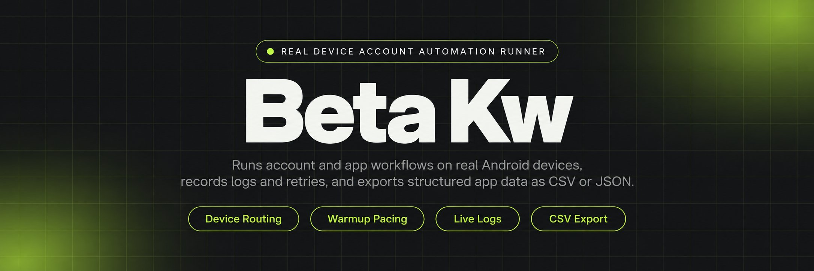
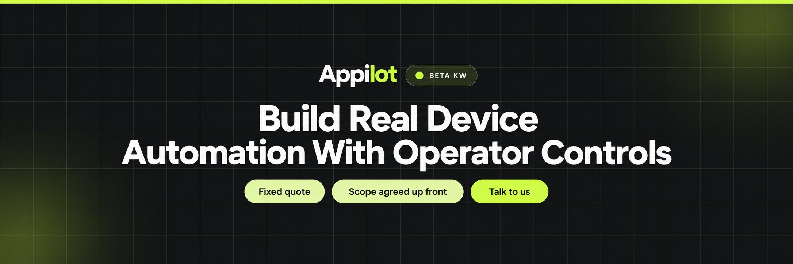
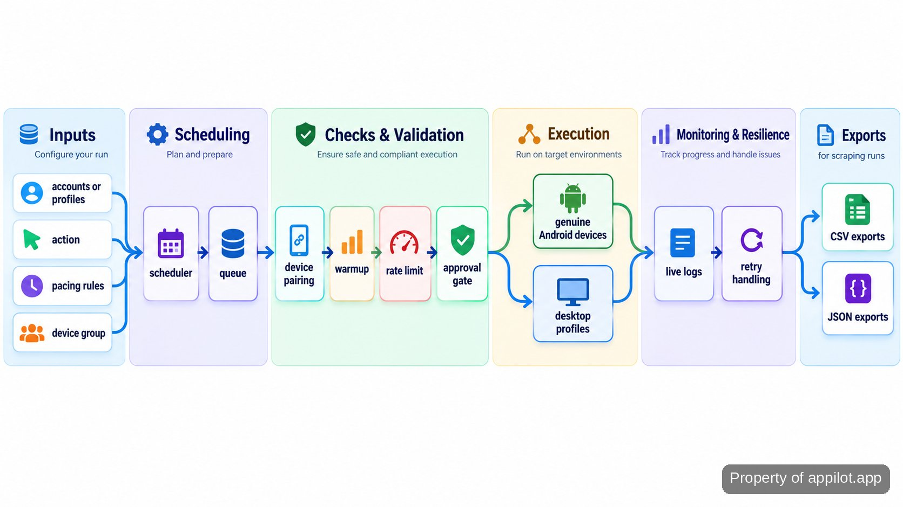

<p align="center">
  <a href="https://www.appilot.app" target="_blank" rel="nofollow">
    
  </a>
</p>

## beta kw

The **beta kw** repository runs account and app automation across genuine Android devices, with the operator dashboard acting as the control point. Jobs can be scheduled, routed to device/profile pairs, paced with warmup and rate-limit rules, retried after recoverable failures, and written to live logs for review. The same system can collect structured mobile app data and export it as CSV or JSON.

This is for work where manual handling stops scaling: many accounts, many profiles, and actions that may run overnight. The important constraint is physical Android hardware rather than emulators. Desktop profile tasks can be routed through isolated profiles, while higher-risk account actions can be held behind approval gates. The page below reflects the repository as it is run: inputs, queue behavior, controls, outputs, and the files that operate it.

<a href="https://www.appilot.app" target="_blank" rel="nofollow">
  
</a>

<p align="center">
  <a href="https://t.me/Bitbash333" target="_blank" rel="nofollow">
    
  </a>&nbsp;
  <a href="https://wa.me/923249868488?text=Hi%2C%20I%27m%20interested." target="_blank" rel="nofollow">
    
  </a>&nbsp;
  <a href="mailto:hello@appilot.app" target="_blank" rel="nofollow">
    
  </a>&nbsp;
  <a href="https://www.appilot.app" target="_blank" rel="nofollow">
    
  </a>
</p>

## The workflow from account input to run output

A run starts with account or profile inputs, the action to perform, the pacing rules, and the target device or profile group. The scheduler places that work in a queue. Before an action is dispatched, the worker checks the device/profile pairing, warmup state, applicable rate limit, and whether the action requires operator approval. Approved work is sent either to a genuine Android device or to a supported desktop profile manager.

Device execution uses the Android control layer exposed through <a href="https://developer.android.com/tools/adb" target="_blank" rel="nofollow">Android Debug Bridge</a>. Desktop routes connect through the <a href="https://localapi-doc-en.adspower.com/docs/Rdw7Iu" target="_blank" rel="nofollow">AdsPower Local API</a> or <a href="https://multilogin.com/help/en_US/api" target="_blank" rel="nofollow">Multilogin API</a>. Each attempt writes a status event. Recoverable failures return to the queue according to retry rules; paused or higher-risk cases stay visible for operator review. Scraping runs pass captured fields through mapping and normalization before the export writer produces CSV or JSON.



## Core Features

| Feature | Description |
| --- | --- |
| Physical-device routing | Emulator-only behavior is not part of this setup. Jobs are assigned to provisioned Android devices, with device and account/profile pairing kept explicit so operators can see where work will run. |
| Scheduled account actions | Manual overnight clicking does not scale. The scheduler queues outreach, engagement, posting, warmup, and other configured account actions so they can run in the defined order and pacing window. |
| Warmup-aware pacing | Fast, uniform activity is a risk operators need to control. Per-workflow limits, queues, and warmup state shape when actions are eligible to run without claiming any platform-determined outcome. |
| Approval gates | Some account actions should not fire unattended. Workflows can stop before configured high-risk actions and wait for an operator decision, leaving the pending item visible in the dashboard. |
| Live logs and retries | Silent failures are expensive when many accounts are active. Each attempt records status and failure detail; recoverable errors can be retried while persistent failures remain available for review. |
| Structured app extraction | Copying mobile app data by hand is slow and inconsistent. Extraction runs map captured fields into a defined schema, normalize values, and write CSV or JSON outputs. |

## Controls for accounts, profiles, and devices

The main operating rule is separation. An account is not treated as an interchangeable job token: it is associated with the device or desktop profile used for that workflow, together with its warmup and pacing state. That matters when a queue contains accounts at different stages. A newly warming profile should not inherit the same activity pattern as one already running a normal campaign.

The dashboard is where those differences stay visible. Operators can inspect pending work, current runs, completed actions, retries, and paused items before deciding what moves next. Rate limits are configured as pacing controls, not as promises that an account will avoid being flagged or banned. Approval gates provide the same kind of boundary for actions judged higher risk. If a device drops or a session fails, the run history keeps the failure attached to the specific job instead of turning it into an unexplained missing action.

A useful failure check is to follow one job across the full record rather than reading the dashboard totals alone. The job should show its original account/profile selection, assigned device or desktop profile, pacing decision, approval state, execution attempt, and final status in sequence. If it fails after dispatch, the next operator should be able to tell whether the cause was device availability, session state, provider response, or extraction logic without replaying the action blindly. That trace is especially important on overnight runs, where an unexplained retry can otherwise look identical to a deliberate second action.

<a href="https://tally.so/r/yP5oDx?platform=GitHub&amp;format=Product+repo&amp;brand=Appilot&amp;niche=appilot&amp;page=Beta+Kw+on+Real+Android+Devices&amp;date=2026-09-24" target="_blank" rel="nofollow">
  
</a>

## Use Cases

- **Run scheduled engagement overnight.** Queue account actions with warmup-aware pacing, send eligible jobs to paired devices or profiles, and review the resulting log the next morning instead of operating every account by hand.
- **Warm accounts before campaign work.** Use staged warmup playbooks, keep the device/profile pairing stable, and pause work when the configured health or risk rules say the account needs operator attention.
- **Extract app data into a usable dataset.** Capture the required mobile fields on genuine Android hardware, normalize them to the repository schema, then write <a href="https://www.rfc-editor.org/rfc/rfc4180" target="_blank" rel="nofollow">CSV</a> or <a href="https://www.rfc-editor.org/rfc/rfc8259" target="_blank" rel="nofollow">JSON</a> for downstream analysis.
- **Route desktop profile tasks.** Send profile-group work through the configured AdsPower or Multilogin integration while keeping centralized status, failure details, and operator controls in the same run view.

## Tech Stack

The repository is a small service stack rather than a single script. Python owns the workers and adapters because the work is I/O-heavy and integration-driven. <a href="https://fastapi.tiangolo.com/" target="_blank" rel="nofollow">FastAPI</a> serves the operator API and dashboard endpoints. <a href="https://www.postgresql.org/docs/" target="_blank" rel="nofollow">PostgreSQL</a> stores durable account, device, job, approval, and run records, while <a href="https://redis.io/docs/latest/" target="_blank" rel="nofollow">Redis</a> holds short-lived queue state and worker coordination. <a href="https://docs.docker.com/compose/" target="_blank" rel="nofollow">Docker Compose</a> keeps those services reproducible on the machine that runs the fleet controller.

| Layer | What it does here |
| --- | --- |
| Worker process | Claims queued jobs, applies pacing and approval checks, calls the Android or desktop adapter, then records the result. |
| Android adapter | Sends commands to attached physical devices and reports device availability back to the scheduler. |
| Desktop adapters | Translate profile-group tasks into the supported AdsPower or Multilogin API calls without mixing provider-specific details into the queue logic. |
| Data pipeline | Maps captured app fields, normalizes values, validates the export shape, and hands clean rows to the CSV or JSON writer. |
| Operator API | Exposes jobs, devices, logs, approvals, retries, and pause/resume controls to the dashboard. |

## Directory Structure

The file layout keeps provider adapters, queue logic, governance rules, and export code separate. That makes operational changes easier to review: a pacing-rule change does not require touching the Android driver, and an export-field change does not alter desktop profile routing. Configuration lives outside the core modules so account groups, device groups, schedules, and field maps can change without rewriting the execution path.

```text
automation-runner/
├── app/
│   ├── api/
│   │   ├── routes.py
│   │   └── schemas.py
│   ├── workers/
│   │   ├── runner.py
│   │   ├── scheduler.py
│   │   └── retries.py
│   ├── adapters/
│   │   ├── android.py
│   │   ├── adspower.py
│   │   └── multilogin.py
│   ├── governance/
│   │   ├── pacing.py
│   │   ├── approvals.py
│   │   └── warmup.py
│   ├── extract/
│   │   ├── mapping.py
│   │   ├── normalize.py
│   │   └── writers.py
│   ├── models.py
│   └── settings.py
├── config/
│   ├── devices.example.yml
│   ├── workflows.example.yml
│   └── fields.example.yml
├── scripts/
│   ├── check_devices.py
│   └── run_worker.py
├── tests/
│   ├── test_pacing.py
│   ├── test_retries.py
│   └── test_exports.py
├── docker-compose.yml
├── .env.example
└── README.md
```

## How to Run Account Workflows Using beta kw

- **STEP 1 — Download & Set Up the Project.** Download, set up, and install **beta kw** from this repository, copy the example environment file, then start the dashboard and worker services with Docker Compose.
- **STEP 2 — Open the dashboard.** Confirm the expected Android devices or desktop profile groups are available, then open the jobs view and check any paused or pending approvals.
- **STEP 3 — Configure the run.** Choose the account/profile group, action, schedule, pacing rule, warmup state, and target device group; for extraction jobs, select the saved field map.
- **STEP 4 — Start and inspect output.** Submit the job, follow status and retry events in the live log, then review completed actions or the generated CSV/JSON dataset.

```bash
cp .env.example .env
docker compose up -d
docker compose exec api python scripts/check_devices.py
docker compose exec worker python scripts/run_worker.py
```

## Performance Benchmarks and run evidence

There is no useful single speed number for this repository because pacing is part of the control model. A scraping job, a warmup action, and a desktop profile task should not be compared by raw actions per minute. The run evidence that matters is already in the logs: queue wait time, action duration, retry count, device availability, approval wait, completed versus failed jobs, and export row count. Those measures show whether the system is moving work or merely hiding delay.

For a practical benchmark, run the same saved workflow against the same device or profile group and compare its log summaries before and after a configuration or code change. Keep pacing rules unchanged, then inspect failure type and retry behavior rather than pushing activity faster just to improve a throughput figure. Mobile-security checks should also be reviewed against a stable reference such as the <a href="https://mas.owasp.org/MASVS/" target="_blank" rel="nofollow">OWASP Mobile Application Security Verification Standard</a> and the <a href="https://owasp.org/www-project-mobile-top-10/" target="_blank" rel="nofollow">OWASP Mobile Top 10</a>. The repository should be judged by repeatable execution, traceable failures, and clean outputs, not by a claim that platforms themselves control.

## FAQ

### Does this use Android emulators?

No. The mobile automation path is designed for genuine Android hardware, and device routing is explicit in the job records. Desktop profile work is a separate path through supported profile-manager APIs rather than an emulator substitute.

### How are risky account actions controlled?

Configured higher-risk actions can stop at an approval gate before execution. Warmup state, pacing rules, and queues also influence when work is eligible to run. These controls govern the automation; they do not promise that a platform will never flag or ban an account.

### What data can the scraping workflow export?

The extraction path writes the fields defined by the saved mapping for that app session, then normalizes them before export. The supported output formats on this page are CSV and JSON, so downstream work can consume a structured dataset rather than copied screen text.

<table>
  <tr>
    <td align="center" width="33%">
      
      <p>This scraper helped me gather thousands of posts effortlessly. The setup was fast, and exports are super clean and well-structured.</p>
      <p><b>Nathan Pennington</b><br>Marketer<br>★★★★★</p>
    </td>
    <td align="center" width="33%">
      
      <p>What impressed me most was how accurate the extracted data is. Likes, comments, timestamps — everything aligns perfectly.</p>
      <p><b>Greg Jeffries</b><br>SEO Affiliate Expert<br>★★★★★</p>
    </td>
    <td align="center" width="33%">
      
      <p>It's by far the best tool I've used. Ideal for trend tracking, competitor monitoring, and influencer insights.</p>
      <p><b>Karan</b><br>Digital Strategist<br>★★★★★</p>
    </td>
  </tr>
</table>