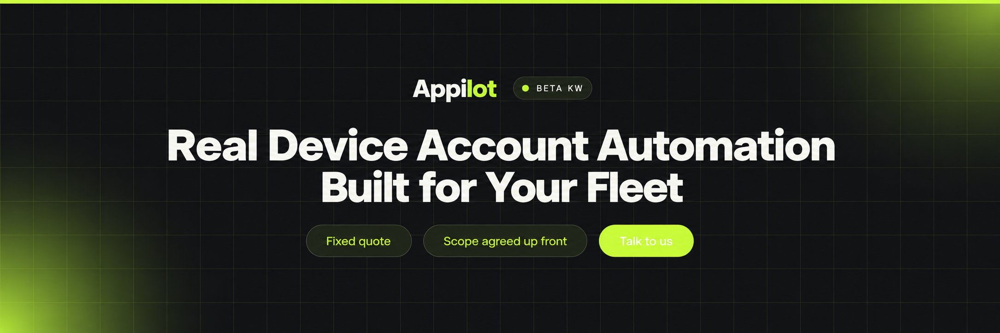
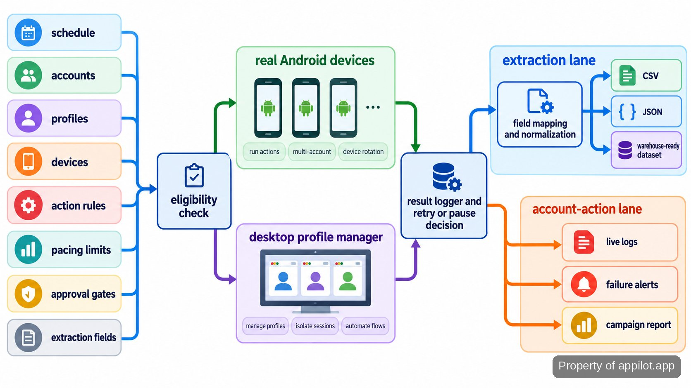

<p align="center">
  <a href="https://www.appilot.app" target="_blank" rel="nofollow">
    
  </a>
</p>

## Beta Kw

Beta Kw is the account-operations tool in this repository. It runs scheduled mobile actions on genuine Android hardware, routes desktop work through isolated profiles, extracts structured app data, and applies pacing, retries, approval gates, and pause rules around account activity. The practical point is simple: a queue of accounts and devices can keep moving without an operator clicking through every session by hand.

The tool is meant for many-account work where the expensive failure is not a slow click but a flagged or banned account. It does not promise that automation is invisible or that an account cannot be banned. Instead, it exposes the controls an operator can actually own: device/profile pairing, staged warmup, rate limits, human approval for higher-risk actions, live logs, failure alerts, and runbooks for recovery.

<a href="https://www.appilot.app" target="_blank" rel="nofollow">
  
</a>

<p align="center">
  <a href="https://t.me/Bitbash333" target="_blank" rel="nofollow">
    
  </a>&nbsp;
  <a href="https://wa.me/923249868488?text=Hi%2C%20I%27m%20interested." target="_blank" rel="nofollow">
    
  </a>&nbsp;
  <a href="mailto:hello@appilot.app" target="_blank" rel="nofollow">
    
  </a>&nbsp;
  <a href="https://www.appilot.app" target="_blank" rel="nofollow">
    
  </a>
</p>

## What It Runs

Mobile jobs execute on real Android phones rather than emulators. The repository talks to attached devices through <a href="https://developer.android.com/tools/adb" target="_blank" rel="nofollow">Android Debug Bridge</a>, the command-line interface for communicating with Android hardware. Each job carries the account, device assignment, action, schedule, and pacing rules. A worker takes the next eligible job, checks whether the account or device is paused, executes the allowed action, and records the result before the queue advances.

Desktop work is routed through fingerprint-isolated profiles. A profile is a browser environment with its own stored identity and session state. The integration layer targets <a href="https://localapi-doc-en.adspower.com/docs/Rdw7Iu" target="_blank" rel="nofollow">AdsPower Local API</a> and <a href="https://multilogin.com/help/en_US/multilogin-x-api-beginners-guide" target="_blank" rel="nofollow">Multilogin automation APIs</a>, so profile start, stop, grouping, and task routing stay outside the action code. That separation matters when a profile is flagged: the operator can pause or re-route work without rewriting the job itself.

A normal warmup run shows the separation clearly. The scheduler can pick an eligible account from the warmup queue, keep it paired to its assigned device or profile, apply that playbook’s pacing, then write the action result to the shared log. If the account is paused, the job stays out of execution. If the action needs approval, it waits at that gate. Nothing in this path assumes that completing the action means the platform will accept it.

## Core Features

| Feature | Description |
| --- | --- |
| Real Android device routing | Manual phone handling breaks down when accounts outnumber hands. Jobs are assigned to physical Android devices, with centralized scheduling, remote operations, and device/profile pairing. |
| Warmup-aware pacing | New or sensitive accounts should not jump straight into full-volume activity. Staged warmup playbooks, rate limits, queues, health scoring, and pause-on-risk rules control when actions are eligible to run. |
| Approval gates | Some account actions deserve a human decision before execution. High-risk actions can stop at an approval gate instead of moving automatically from queue to device. |
| Profile-group desktop routing | Opening and managing isolated desktop sessions one by one wastes operator time. Tasks can be routed by profile group through AdsPower or Multilogin integrations, with session hygiene and humanized timing. |
| Structured app extraction | Copying app data into spreadsheets by hand creates drift and missing fields. Extraction jobs map fields, normalize records, and write warehouse-ready CSV or JSON. |
| Logs, retries, and alerts | Silent failures are dangerous when jobs run overnight. Live logs show what ran, retries handle recoverable failures, and failure alerts surface jobs that need operator attention. |

## Pipeline From Queue to Output

Every run follows the same visible pipeline. Inputs arrive as scheduled jobs plus account, profile, device, action, pacing, approval, and extraction settings. Eligibility checks happen first. A paused account, unavailable device, or unmet approval does not proceed. Eligible work is then routed either to a real Android device or to the configured desktop profile manager. The action result returns to the control layer, where the run is logged and any recoverable failure can be retried.

Extraction jobs add one more stage: field mapping and normalization before export. CSV is documented in <a href="https://www.rfc-editor.org/info/rfc4180/" target="_blank" rel="nofollow">RFC 4180</a> and JSON in <a href="https://www.rfc-editor.org/info/rfc8259/" target="_blank" rel="nofollow">RFC 8259</a>; the repository uses those formats because they are easy to inspect, diff, load into spreadsheets, or hand to a warehouse process. Account-action jobs instead finish with run status, logs, alerts when something failed, and campaign reporting where that workflow is enabled.



<a href="https://tally.so/r/yP5oDx?platform=GitHub&amp;format=Product+repo&amp;brand=Appilot&amp;niche=appilot&amp;page=Beta+Kw+on+Android+Hardware&amp;date=2026-09-24" target="_blank" rel="nofollow">
  
</a>

## Runtime Stack and Configuration

The repository uses a small control plane rather than hiding operations behind one opaque binary. Python is the orchestration layer for queue handling, rules, API calls, exports, and CLI commands. ADB is the hardware bridge for Android devices. HTTP JSON calls connect the desktop profile adapters. The operator-facing dashboard reads the same run state that the workers write, which keeps scheduling, retries, logs, and manual pauses aligned.

Configuration is split by concern: account assignments, device inventory, profile groups, warmup playbooks, action limits, approval policy, and extraction field maps. That layout makes a risky change reviewable. Changing a field mapping should not touch device routing; changing warmup pacing should not alter export code. For external context on the operating environment, <a href="https://www.gsma.com/about-us/regions/europe/gsma_resources/the-mobile-economy-2026/" target="_blank" rel="nofollow">The Mobile Economy 2026</a> and <a href="https://datareportal.com/reports/digital-2026-mid-year-global-update-report" target="_blank" rel="nofollow">Digital 2026 Mid-Year Global Update</a> are useful mobile and social benchmarks, but they are not runtime settings or guarantees for this tool.

The `check` command is the first operational gate. It catches missing device assignments, unreachable profile-manager access, and configuration states that would make a scheduled job impossible to route. Running that check before an overnight batch is more useful than discovering at breakfast that the queue spent the night waiting on a device or profile that was never available.

```bash
python3 -m runner check
python3 -m runner run --job warmup
python3 -m runner run --job outreach
python3 -m runner export --format csv
python3 -m runner export --format json
```

## Project Directory

The file layout mirrors the run path so an operator can find the part that failed. Device and profile adapters are separate from policies; policies are separate from jobs; exporters are separate from the action runners. Logs and generated exports live outside source folders, which keeps code review focused on behavior rather than run artifacts.

```text
account-ops/
├── runner/
│   ├── __main__.py
│   ├── queue.py
│   ├── scheduler.py
│   ├── policies.py
│   ├── approvals.py
│   ├── alerts.py
│   ├── devices/
│   │   ├── adb.py
│   │   └── registry.py
│   ├── profiles/
│   │   ├── adspower.py
│   │   └── multilogin.py
│   ├── jobs/
│   │   ├── warmup.py
│   │   ├── engagement.py
│   │   ├── outreach.py
│   │   └── extract.py
│   └── exports/
│       ├── csv_export.py
│       ├── json_export.py
│       └── normalize.py
├── config/
│   ├── accounts.yaml
│   ├── devices.yaml
│   ├── profiles.yaml
│   ├── limits.yaml
│   ├── approvals.yaml
│   └── fields.yaml
├── playbooks/
│   ├── warmup.yaml
│   ├── session-hygiene.md
│   └── recovery.md
├── logs/
├── exports/
├── requirements.txt
└── README.md
```

## Use Cases

- Keep staged warmup moving across many accounts without manually opening each device. Accounts follow the configured playbook, device/profile pairing stays consistent, and pause-on-risk rules stop work that should not continue.
- Run scheduled outreach, engagement, or posting queues overnight while retaining human control over higher-risk steps. The operator sees live logs, retries, alerts, and campaign reporting instead of discovering failures the next morning.
- Extract app-session data from real Android devices into normalized CSV or JSON. Custom field maps keep the exported columns consistent when the source app presents data in a less convenient shape.
- Route desktop tasks across grouped AdsPower or Multilogin profiles. The task logic stays the same while profile start, stop, session timing, and group assignment are handled by the adapter layer.

## How to Run Account Automation Using Beta Kw

- **STEP 1 — Download & Set Up the Project** Download, set up, and install **Beta Kw** to get the project running; clone this repository, install its Python requirements, then run the configuration check.
- **STEP 2 — Check Devices and Profiles** Run `python3 -m runner check` to verify configured Android devices, profile-manager access, account assignments, and any paused or blocked work before scheduling actions.
- **STEP 3 — Choose the Job and Rules** Select the warmup, outreach, engagement, posting, or extraction job, then set account groups, device/profile routing, pacing limits, approvals, and extraction fields that apply.
- **STEP 4 — Run and Read the Output** Start the chosen `runner run` command. Read live logs and alerts for action jobs, or generate normalized CSV/JSON files for extraction runs.

## Failure Handling and Operator Controls

The failure model is deliberately visible. A recoverable task can retry; an account or device that crosses a configured risk condition can be paused; an action behind an approval gate waits instead of guessing. Those states belong in the logs so a person can distinguish “not run,” “retried,” “paused,” and “completed” without reading worker code. The runbook then tells the operator what to check before releasing work back into the queue.

There is no ban-proof switch and no published uptime or throughput figure to repeat here. Pacing depends on the account playbook, platform context, device availability, and the limits configured for that job. The documented delivery process includes weekly progress logs during development and a 30-day post-launch support and monitoring window; ongoing operation after handoff depends on the runbooks, hygiene rules, alerts, and controls stored with the project. That is the right level of certainty for a system whose external platforms still make the final enforcement decisions.

## FAQ

### Does this system guarantee that accounts will not be banned?

No. The system controls pacing, queues, staged warmup, device/profile pairing, approval gates, health scoring, and pause-on-risk rules, but none of those can guarantee how an external platform will treat an account. Treat a ban or flag as an operating risk to monitor, not an outcome the repository can prevent by promise.

### Does it run mobile automation on emulators?

No. Mobile automation runs on genuine Android hardware. The device layer is separate from the desktop profile layer, so real-phone jobs and AdsPower or Multilogin profile jobs share scheduling and logging without pretending that a browser profile is an Android device.

### What data can the extraction workflow export?

Extraction jobs produce structured CSV or JSON and can prepare warehouse-ready records after custom field mapping and normalization. The exact columns come from the configured field map for the app session; the page does not claim fields that are not defined in that mapping.

<table>
  <tr>
    <td align="center" width="33%">
      
      <p>This scraper helped me gather thousands of posts effortlessly. The setup was fast, and exports are super clean and well-structured.</p>
      <p><b>Nathan Pennington</b><br>Marketer<br>★★★★★</p>
    </td>
    <td align="center" width="33%">
      
      <p>What impressed me most was how accurate the extracted data is. Likes, comments, timestamps — everything aligns perfectly.</p>
      <p><b>Greg Jeffries</b><br>SEO Affiliate Expert<br>★★★★★</p>
    </td>
    <td align="center" width="33%">
      
      <p>It's by far the best tool I've used. Ideal for trend tracking, competitor monitoring, and influencer insights.</p>
      <p><b>Karan</b><br>Digital Strategist<br>★★★★★</p>
    </td>
  </tr>
</table>