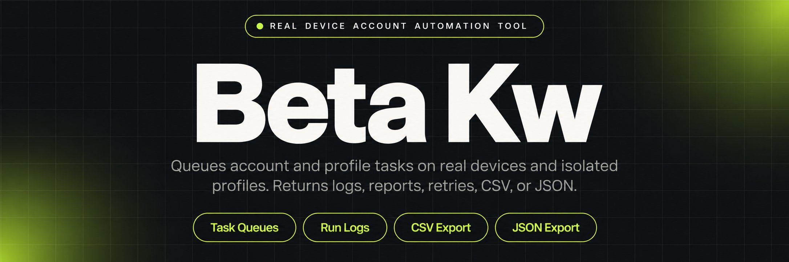
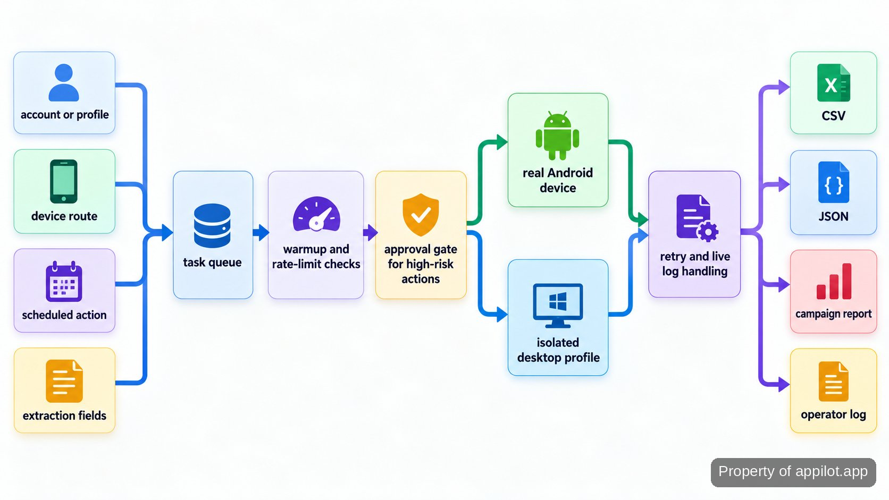

<p align="center">
  <a href="https://www.appilot.app" target="_blank" rel="nofollow">
    
  </a>
</p>

## beta kw

`beta kw` is the repository I use to run scheduled mobile and desktop account automation without treating every account as a one-off manual session. The working path is simple: assign an account to a real Android device or an isolated desktop profile, apply warmup and rate-limit rules, send the task through any required approval gate, run it, and keep the result in the operator log. The same project also handles structured mobile-app extraction, so an overnight run can finish with CSV or JSON data instead of screenshots and copy-paste cleanup.

The useful part is not a single bot action. It is the operating layer around the action: queues, device and profile pairing, live logs, retries, pause-on-risk rules, and a runbook for handing the system to another operator. That matters when manual work stops scaling and the serious failure is not a slow click, but an account being flagged because pacing, warmup, or session hygiene drifted.

<a href="https://www.appilot.app" target="_blank" rel="nofollow">
  
</a>

<p align="center">
  <a href="https://t.me/Bitbash333" target="_blank" rel="nofollow">
    
  </a>&nbsp;
  <a href="https://wa.me/923249868488?text=Hi%2C%20I%27m%20interested." target="_blank" rel="nofollow">
    
  </a>&nbsp;
  <a href="mailto:hello@appilot.app" target="_blank" rel="nofollow">
    
  </a>&nbsp;
  <a href="https://www.appilot.app" target="_blank" rel="nofollow">
    
  </a>
</p>

## Core Features

| Feature | Description |
| --- | --- |
| Real Android execution | Emulator-only workflows can behave differently from the devices used in production. Tasks run against genuine Android hardware, with centralized scheduling and remote fleet operations. |
| Profile-isolated desktop runs | Repeated desktop sessions can collide when profiles are handled loosely. The desktop path routes work through fingerprint-isolated profiles, meaning separate browser identities, and profile managers controlled through their APIs (application programming interfaces), such as <a href="https://localapi-doc-en.adspower.com/docs/Rdw7Iu" target="_blank" rel="nofollow">AdsPower</a> and <a href="https://multilogin.com/help/en_US/api" target="_blank" rel="nofollow">Multilogin</a>. |
| Warmup-aware pacing | Accounts can be flagged when activity jumps too quickly. Staged warmup playbooks, queues, rate limits, and humanized timing keep task volume governed by the configured account state. |
| Approval gates | High-risk account actions should not be buried in an unattended queue. The tool can stop those actions for operator approval before execution. |
| Structured app extraction | Copying app data by hand creates missing fields and inconsistent rows. App sessions map requested fields into normalized records and produce CSV or JSON exports. |
| Retries and failure recovery | A transient device or session failure should not erase the whole run. Failed work is logged, retried through the operating queue, and surfaced for follow-up when recovery does not clear it. |
| Campaign and run reporting | Operators need to know what ran, what paused, and what failed. Centralized logs and campaign reporting provide that record without reconstructing events from individual devices. |

## Workflow from queue to output

Each run starts with three kinds of input: the target account or profile, the device or desktop route, and the requested action or extraction fields. The scheduler writes that work to a queue. Before execution, the worker checks the account’s warmup state, rate-limit rules, and any pause condition. High-risk actions can branch to approval instead of running immediately. The executor then opens the assigned real Android session or isolated desktop profile, performs the queued work, and records the outcome.

Extraction jobs add one more stage: field mapping and normalization. The raw app session is converted into the requested field layout, then written in the two supported export forms, CSV and JSON. Action jobs finish in the same operational record rather than a data file, with status, retry history, and campaign reporting available to the operator. A failed session therefore has somewhere to go: retry if the condition is recoverable, pause if a risk rule fires, or surface the failure for manual review.



## Tech Stack

The repository uses <a href="https://docs.python.org/3/" target="_blank" rel="nofollow">Python</a> for queue workers, adapters, validation, export logic, and command-line entry points. Real Android control is kept behind <a href="https://developer.android.com/tools/adb" target="_blank" rel="nofollow">Android Debug Bridge</a>, so device discovery and command execution are separate from the rules that decide whether a task should run. Desktop profile control sits behind provider adapters, small connectors that translate queued work into each profile manager’s API calls, rather than being mixed into action code.

Local run state and retry bookkeeping live in <a href="https://www.sqlite.org/docs.html" target="_blank" rel="nofollow">SQLite</a>, a local embedded database. It is enough for the operator-side queue without adding a separate database service to every machine. Exports follow the published <a href="https://www.rfc-editor.org/rfc/rfc8259.html" target="_blank" rel="nofollow">JSON format</a> and the common CSV format, which keeps downstream parsing predictable. For broader operating context, I keep the <a href="https://datareportal.com/reports/digital-2026-mid-year-global-update-report" target="_blank" rel="nofollow">Digital 2026 Mid-Year Global Update</a> and the <a href="https://www.gsma.com/about-us/regions/europe/gsma_resources/the-mobile-economy-2026/" target="_blank" rel="nofollow">GSMA Mobile Economy 2026</a> close to the runbook; they are context for device and social usage, not performance claims about this repository.

```bash
python -m venv .venv
source .venv/bin/activate
pip install -r requirements.txt
python -m operator_tool devices list
python -m operator_tool profiles check
python -m operator_tool run --config config/run.yaml
python -m operator_tool export --format csv
python -m operator_tool export --format json
```

<a href="https://tally.so/r/yP5oDx?platform=GitHub&amp;format=Product+repo&amp;brand=Appilot&amp;niche=appilot&amp;page=Beta+Kw+on+Android+Hardware&amp;date=2026-09-24" target="_blank" rel="nofollow">
  
</a>

## Directory Structure

The layout keeps provider-specific control at the edges. Device and profile adapters know how to talk to their endpoints; policies decide pacing, warmup, approvals, and pause conditions; jobs contain the actual action or extraction flow. That split is useful during incidents because a provider failure does not require editing policy logic, and a pacing change does not touch device-control code. Configuration stays outside the job modules so account assignments and run settings can change without a code edit.

```text
automation-control/
├── config/
│   ├── devices.yaml
│   ├── profiles.yaml
│   └── run.yaml
├── operator_tool/
│   ├── cli.py
│   ├── queue.py
│   ├── scheduler.py
│   ├── devices/
│   │   ├── adb.py
│   │   └── registry.py
│   ├── profiles/
│   │   ├── adspower.py
│   │   └── multilogin.py
│   ├── policies/
│   │   ├── warmup.py
│   │   ├── rate_limits.py
│   │   ├── approvals.py
│   │   └── risk_pause.py
│   ├── jobs/
│   │   ├── engagement.py
│   │   ├── outreach.py
│   │   └── extract.py
│   ├── exports/
│   │   ├── csv_writer.py
│   │   └── json_writer.py
│   └── logging.py
├── tests/
│   ├── test_policies.py
│   └── test_exports.py
├── requirements.txt
├── README.md
└── RUNBOOK.md
```

## Use Cases

- **Run account warmup overnight without handing every profile to an operator.** Pair the account with its long-term device or profile, load the staged warmup playbook, and let the queue enforce pacing and pause rules. The next shift starts from the log instead of guessing which accounts were touched.
- **Move repetitive engagement or outreach into governed queues.** Scheduled DM, engagement, posting, and account actions can be routed per profile group, with approval gates reserved for higher-risk work. Operators still control the campaign; the queue removes the repetitive opening, waiting, and switching between accounts.
- **Extract structured mobile-app data from genuine Android sessions.** Define the fields to collect, run the session against the device fleet, normalize the records, then hand CSV or JSON to the next reporting or warehouse step. The value is consistency: the same mapping is applied across runs instead of being re-created by hand.
- **Keep desktop profile work separated while using one operating view.** API-managed isolated profiles receive tasks through the same queue and logging path as mobile work. That makes retries, profile-group routing, and failure review visible from one operator workflow even though the execution environment differs.

## How to Run Account Automation Using beta kw

- **STEP 1 - Download & Set Up the Project.** Download, set up, and install **beta kw** to get the project running. Clone this repository locally, create the virtual environment, install requirements, and copy the provided configuration templates.
- **STEP 2 - Check Devices and Profiles.** Run `devices list` and `profiles check` so the queue only receives Android devices and desktop profiles that the local machine can currently reach.
- **STEP 3 - Load the Run Configuration.** Set account-to-device or profile assignments, warmup state, pacing rules, approval requirements, scheduled actions, and any extraction fields in `config/run.yaml`.
- **STEP 4 - Run and Read the Output.** Start `run --config config/run.yaml`; review the operator log and retry state, then export normalized extraction records as CSV or JSON when the job produces data.

## Failure Handling and Operating Boundaries

The controls are designed to make failures visible and govern what happens next, not to promise that a platform will accept automated activity. Warmup-aware pacing can limit abrupt activity changes. Rate limits can hold tasks in the queue. Approval gates can keep selected account actions out of unattended execution. Health scoring, a configured account-risk status, and pause-on-risk rules can stop a configured path when the account or session crosses the tool’s risk condition. None of those controls makes an account undetectable or ban-proof; the platform still decides how it treats activity.

The performance check is operational rather than a speed claim. Before leaving a run unattended, I verify that assigned devices and profile sessions are reachable, the queue is advancing, retries are not climbing without resolution, and paused accounts remain paused. After completion, the operator log is checked against the scheduled work, and extraction jobs are checked for the requested structured files. That catches a stuck session, broken route, or silent export failure without inventing a jobs-per-hour number.

Operational failures follow a different path. Device, profile, or app-session errors are written to centralized logs and can enter automated retry handling. If recovery does not clear the issue, the runbook tells the operator what to inspect rather than silently skipping the task. The production handoff also included 30-day post-launch support and monitoring, so the early operating period had a defined place for failures to be reviewed. I do not publish a throughput or runtime benchmark here because the supplied repository brief contains no measured figure that can be stated without guessing.

## FAQ

### Does the tool use emulators?

No. The mobile execution path described here runs on genuine Android hardware. Device control is separated from the queue and policy layers, so scheduling, warmup rules, approvals, and logging remain operator-visible while the actual app session runs on a physical device.

### How does it reduce account risk without promising that accounts will not get banned?

It governs the actions the operator controls: warmup stage, pacing, rate limits, queue order, approval gates, device or profile pairing, and pause-on-risk rules. Those mechanisms can prevent the tool from blindly increasing activity or continuing after a configured warning condition, but they cannot decide how a social platform classifies or enforces activity.

### What files and run evidence does it produce?

Extraction jobs can produce normalized CSV or JSON datasets. Operational runs also leave centralized logs, retry state, and campaign reporting so an operator can see what ran, what paused, and what failed. The repository keeps those output concerns separate from provider adapters and policy logic, which makes failures easier to trace.

<table>
  <tr>
    <td align="center" width="33%">
      
      <p>This scraper helped me gather thousands of posts effortlessly. The setup was fast, and exports are super clean and well-structured.</p>
      <p><b>Nathan Pennington</b><br>Marketer<br>★★★★★</p>
    </td>
    <td align="center" width="33%">
      
      <p>What impressed me most was how accurate the extracted data is. Likes, comments, timestamps — everything aligns perfectly.</p>
      <p><b>Greg Jeffries</b><br>SEO Affiliate Expert<br>★★★★★</p>
    </td>
    <td align="center" width="33%">
      
      <p>It's by far the best tool I've used. Ideal for trend tracking, competitor monitoring, and influencer insights.</p>
      <p><b>Karan</b><br>Digital Strategist<br>★★★★★</p>
    </td>
  </tr>
</table>