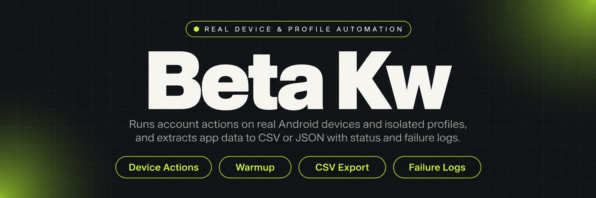
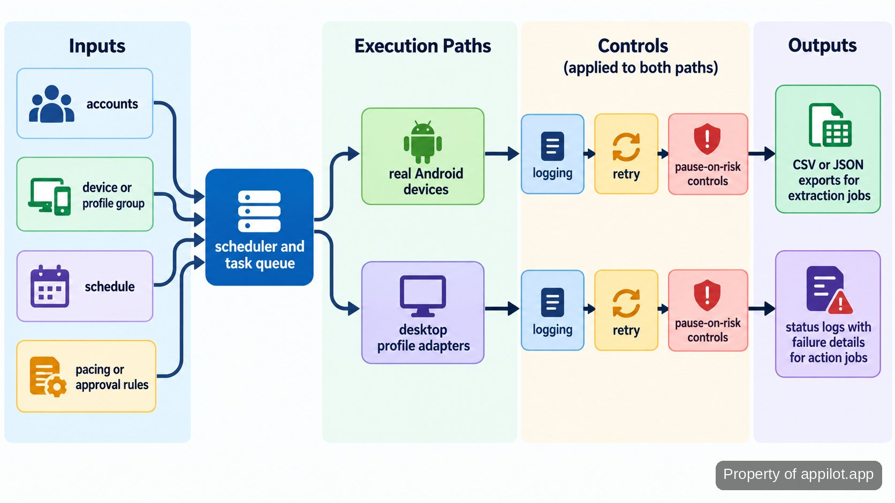

<p align="center">
  <a href="https://www.appilot.app" target="_blank" rel="nofollow">
    
  </a>
</p>

## beta kw

**beta kw** is the repository I run when account work has to move across real Android phones, desktop profiles, and scheduled jobs without becoming a pile of one-off scripts. Mobile tasks run on physical devices rather than emulators. Desktop tasks route into isolated profiles. A run can schedule account actions, collect app data, apply warmup pacing, record logs, and retry recoverable failures. High-risk actions can stop at an approval gate instead of firing automatically.

The practical fit is an operator managing many accounts or devices at once. A job starts from configuration or the operator dashboard, gets assigned to the correct device or profile, runs under rate limits and queue rules, and leaves an auditable result. Extraction jobs return CSV or JSON; action jobs return status, logs, and failure details. Runbooks cover device pairing, profile hygiene, and failure recovery so a stopped run can be investigated without guesswork.

<a href="https://www.appilot.app" target="_blank" rel="nofollow">
  
</a>

<p align="center">
  <a href="https://t.me/Bitbash333" target="_blank" rel="nofollow">
    
  </a>&nbsp;
  <a href="https://wa.me/923249868488?text=Hi%2C%20I%27m%20interested." target="_blank" rel="nofollow">
    
  </a>&nbsp;
  <a href="mailto:hello@appilot.app" target="_blank" rel="nofollow">
    
  </a>&nbsp;
  <a href="https://www.appilot.app" target="_blank" rel="nofollow">
    
  </a>
</p>

## How the workflow moves from queue to output

Every run follows one visible pipeline. An operator supplies accounts or extraction targets, chooses the device or profile group, sets the schedule, and applies pacing or approval rules. The scheduler turns that configuration into queued tasks. Mobile tasks go to genuine Android hardware; desktop tasks go through the matching profile adapter. Each worker writes start, completion, retry, and error events so the dashboard shows what is running and what needs attention.

Warmup jobs use staged playbooks instead of the same activity pattern from the first session. Engagement jobs respect configured rate limits and queue spacing. Extraction jobs map captured fields into a normalized record before export. Recoverable failures can retry; configured risk rules can pause an account or device rather than continue blindly. The diagram is the pipeline I use when troubleshooting: inputs on the left, controlled execution in the middle, operator-readable outputs on the right.



## Core Features

| Feature | Description |
| --- | --- |
| Real Android device execution | Emulator-only workflows can differ from the phones operators actually manage. Mobile jobs run on physical Android devices with centralized scheduling and remote device handling. |
| Profile-routed desktop tasks | Mixing accounts inside the wrong browser identity creates avoidable risk. Tasks route by profile group through API integrations for isolated desktop profiles. |
| Warmup-aware pacing | New or sensitive accounts should not receive the same activity pattern as established ones. Staged warmup playbooks, queues, and rate limits control when actions may run. |
| Approval gates | Some account actions should remain human decisions. High-risk steps can wait for operator approval instead of executing automatically. |
| Structured app extraction | Copying app data by hand does not hold up across many devices. Jobs normalize mapped fields and write CSV, JSON, or warehouse-ready records. |
| Logs, retries, and pause rules | A failed device action is costly when nobody can see why. The run records errors, retries recoverable work, and can pause when configured risk rules fire. |

## Inputs, controls, and outputs

The main input is a run configuration: accounts in scope, the device or desktop profile group allowed to touch them, the action or extraction job, and when it may run. Account-action controls cover queue order, rate limits, warmup stage, approvals, and pause rules. Extraction adds fields to capture and the normalization mapping used before export.

Outputs stay plain. Action jobs produce status plus logs showing the account, assigned device or profile, timestamps, retries, and failure reason. Extraction jobs produce structured data rather than screenshots or copied text, with CSV and JSON exports and a warehouse-ready shape when that path is configured. Operators need to know whether work ran and why it stopped; data users need records they can sort, join, or load elsewhere.

## Tech Stack

The control layer is <a href="https://docs.python.org/3/" target="_blank" rel="nofollow">Python</a>, keeping the CLI, scheduler, adapters, normalization code, and reporting in one language. Device discovery and low-level Android communication use <a href="https://developer.android.com/tools/adb" target="_blank" rel="nofollow">Android Debug Bridge</a>. UI-level mobile automation uses <a href="https://appium.io/docs/en/latest/" target="_blank" rel="nofollow">Appium</a> so a task can interact with an installed app on a connected phone while device handling stays separate from action logic.

Desktop profile work sits behind HTTP adapters rather than inside mobile code. The repository has adapters for <a href="https://localapi-doc-en.adspower.com/" target="_blank" rel="nofollow">AdsPower's Local API</a> and <a href="https://multilogin.com/help/en_US/" target="_blank" rel="nofollow">Multilogin's API documentation</a>, so tasks can request the correct profile group before running. Logs are structured records shared by the dashboard and CLI. For operational review, <a href="https://developer.android.com/topic/performance/vitals" target="_blank" rel="nofollow">Android vitals</a> provides device-side quality signals, while the <a href="https://mas.owasp.org/MASVS/" target="_blank" rel="nofollow">OWASP Mobile Application Security Verification Standard</a> gives a useful security benchmark for the mobile control path.

<a href="https://tally.so/r/yP5oDx?platform=GitHub&amp;format=Product+repo&amp;brand=Appilot&amp;niche=appilot&amp;page=beta+kw+on+Real+Android+Devices&amp;date=2026-09-24" target="_blank" rel="nofollow">
  
</a>

## Directory Structure

The repository separates device control, profile control, scheduling, extraction, and reporting so failures stay local to the part that caused them. Mobile workers do not know how a desktop profile launches, and normalization code does not know how an account action is paced. When a device drops offline or a profile API changes, the affected adapter can be repaired without rewriting the rest of the run path.

```text
beta-kw/
├── app/
│   ├── cli.py
│   ├── scheduler.py
│   ├── queue.py
│   ├── devices/
│   │   ├── adb.py
│   │   ├── appium.py
│   │   └── registry.py
│   ├── profiles/
│   │   ├── adspower.py
│   │   └── multilogin.py
│   ├── actions/
│   │   ├── engagement.py
│   │   ├── warmup.py
│   │   └── approvals.py
│   ├── extract/
│   │   ├── capture.py
│   │   ├── normalize.py
│   │   └── export.py
│   └── reporting/
│       ├── events.py
│       └── dashboard.py
├── configs/
│   ├── devices.example.yaml
│   └── run.example.yaml
├── runbooks/
│   ├── device-hygiene.md
│   └── failure-recovery.md
├── requirements.txt
└── README.md
```

Configuration examples live outside the application package, so account lists and scheduling rules can change without editing code. Runbooks sit beside the executable project because device hygiene and failure recovery are operating requirements, not tribal knowledge. The split also gives the CLI and dashboard one shared event model: the same failure record can be inspected from either surface, which matters when an overnight queue needs triage before more work is released.

## Account pacing and operator controls

Automation does not decide whether a platform will flag or ban an account. The controls reduce avoidable operator mistakes: rate limits space actions, account activity stays with its assigned device or profile, staged playbooks govern warmup, and approval gates hold configured high-risk actions. Health scoring can feed pause rules so a run stops when the account or device state crosses the threshold defined for that playbook.

Those controls also contain failures. A queue can stop sending work to an unavailable device, while retries handle failures safe to attempt again. Logs preserve the path from scheduled task to assignment to final status. <a href="https://developer.android.com/training/testing" target="_blank" rel="nofollow">Android testing guidance</a> is useful context for repeatable test behavior; production runs here still assume real accounts on real hardware with human governance around sensitive actions.

## Use Cases

- **Run scheduled engagement across many accounts.** Queue account actions, assign them to the correct devices or desktop profiles, apply pacing rules, and review failures from one operator view.
- **Warm up accounts before higher-volume campaigns.** A staged playbook controls activity, preserves device/profile pairing, scores account health, and pauses work when configured risk rules say to stop.
- **Extract structured data from a mobile app.** Open the app on genuine Android hardware, capture mapped fields, normalize records, and export CSV, JSON, or a warehouse-ready dataset.
- **Operate isolated desktop profiles at scale.** Profile-group routing sends each task through the appropriate API-managed browser profile while logs show which profile handled the run and whether it completed.

These cases share one requirement: manual work stops scaling when one operator owns many accounts or devices. The repository turns that work into named jobs with explicit inputs, pacing, ownership, and outputs. It does not remove judgment. Approval gates, pause rules, and logs exist because account state can change and continuing a bad run can be worse than stopping it.

## How to Run Multi-Account Automation Using beta kw

- **STEP 1 — Download & Set Up the Project.** Download, set up, and install **beta kw** to get the project running from the repository copy provided with the build.
- **STEP 2 — Register Devices and Profiles.** Open the operator dashboard, confirm connected Android devices, and sync the desktop profile groups that may receive scheduled tasks.
- **STEP 3 — Configure the Run.** Choose accounts, the action or extraction job, device or profile group, schedule, pacing limits, warmup stage, approval gate, and pause rules.
- **STEP 4 — Start and Review.** Start the queued run, then review live status, retries, and failures; extraction jobs finish with structured CSV or JSON output.

The run path is intentionally boring: register resources once, describe each job in configuration, then use the dashboard for release and observation. That keeps account lists and pacing rules out of worker code. For extraction, the same run record points to the exported dataset; for action jobs, it points to status and failure history. The CLI mirrors those operations for repository-first use.

```bash
python -m venv .venv
python -m pip install -r requirements.txt
python -m app.cli devices sync
python -m app.cli run configs/run.yaml
```

## Performance Benchmarks

The repository does not publish a throughput, uptime, or ban-rate claim. Those figures depend on device condition, app behavior, network quality, account state, action type, and selected pacing. The useful benchmark is operational: queue delay, execution duration, retry count, failure rate by action, and the share of tasks paused by risk rules. Those values come from the same structured events used by the dashboard, so the measurement path is visible rather than inferred from a final success count.

When a run slows down, I check where time accumulated: before assignment, during device execution, inside a profile launch, or across retries. A rising retry count points to a different problem than a long queue delay. Extraction jobs add a record-completeness check after normalization. The command below exposes recent failures without changing a running queue, which helps decide whether to retry, pause a device, or inspect an account manually.

```bash
python -m app.cli status --failures
python -m app.cli export --format json
```

## FAQ

### Does this use emulators or real Android devices?

It runs mobile automation on genuine Android hardware, not emulators. Device registration, scheduling, app interaction, logs, and retries are built around physical phones; desktop work uses separate isolated profile adapters.

### How does it reduce the chance of accounts getting flagged?

It controls operator behavior rather than promising a platform outcome. Rate limits, warmup pacing, device/profile pairing, health scoring, pause rules, and approval gates reduce avoidable mistakes, but the tool is not undetectable or ban-proof.

### What happens when a device or task fails during a run?

The failure is logged with the assigned device or profile and error details. Recoverable work can retry; device or account risk rules can pause further activity so the run does not continue silently.

<table>
  <tr>
    <td align="center" width="33%">
      
      <p>This scraper helped me gather thousands of posts effortlessly. The setup was fast, and exports are super clean and well-structured.</p>
      <p><b>Nathan Pennington</b><br>Marketer<br>★★★★★</p>
    </td>
    <td align="center" width="33%">
      
      <p>What impressed me most was how accurate the extracted data is. Likes, comments, timestamps — everything aligns perfectly.</p>
      <p><b>Greg Jeffries</b><br>SEO Affiliate Expert<br>★★★★★</p>
    </td>
    <td align="center" width="33%">
      
      <p>It's by far the best tool I've used. Ideal for trend tracking, competitor monitoring, and influencer insights.</p>
      <p><b>Karan</b><br>Digital Strategist<br>★★★★★</p>
    </td>
  </tr>
</table>